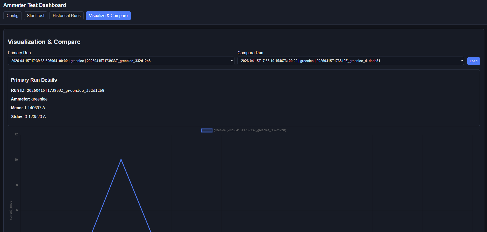

# Ammeter Testing Framework


[](https://github.com/<OWNER>/<REPO>/actions/workflows/ci.yml)

Python project implementing a unified current-measurement test framework and a web UI for:

- configuration management
- test execution
- historical run browsing
- per-run visualization and run-to-run comparison

Supported ammeter emulators:

- `greenlee`
- `entes`
- `circutor`

## Environment Setup (`uv` + local `.venv`)

```powershell
uv venv .venv
uv pip install --python ".venv\Scripts\python.exe" -r requirements.txt
```

## Project Layout

- `main.py` - starts emulator servers and performs one live request per ammeter.
- `examples/run_tests.py` - CLI example that executes tests and prints summary statistics.
- `run_web.py` - starts the FastAPI UI server.
- `Ammeters/` - emulator servers + socket client helper.
- `src/testing/test_framework.py` - core test API:
  - `run_test(...)`
  - `load_result(...)`
  - `list_historical_results(...)`
  - `compare_runs(...)`
- `src/storage/sqlite_repository.py` - SQLite schema and persistence layer.
- `src/web/app.py` - FastAPI app, routes, and API handlers.
- `src/web/templates/` - Jinja HTML templates.
- `src/web/static/` - CSS/JS assets.
- `config/config.yaml` - sampling defaults, ammeter command/port map, SQLite DB path.

## Ammeter Protocol

| Ammeter | Port | Command |
|---|---:|---|
| Greenlee | `5000` | `MEASURE_GREENLEE -get_measurement` |
| ENTES | `5001` | `MEASURE_ENTES -get_data` |
| CIRCUTOR | `5002` | `MEASURE_CIRCUTOR -get_measurement -current` |

## Run CLI Examples

### Emulator sanity check

```powershell
.\.venv\Scripts\python.exe main.py
```

### Full framework run

```powershell
.\.venv\Scripts\python.exe examples\run_tests.py
```

## Run Web UI

```powershell
.\.venv\Scripts\python.exe run_web.py
```

Open [http://127.0.0.1:8000](http://127.0.0.1:8000).

UI tabs/pages:

- `Config` - update sampling, ammeter endpoints, and DB path.
- `Start Test` - trigger a run with optional sampling overrides.
- `Historical Runs` - filter and browse archived runs.
- `Visualize & Compare` - chart a selected run and compare two runs.

## SQLite Storage

Results are stored in SQLite at:

- `result_management.database_path` (default: `results/ammeter_results.db`)

Schema:

- `test_runs`:
  - `test_run_id`, `timestamp_utc`, `ammeter_type`
  - sampling fields (`sampling_count`, `sampling_duration_seconds`, `sampling_frequency_hz`)
  - `actual_duration_seconds`
  - `statistics_json`, `metadata_json`
- `test_samples`:
  - `test_run_id`, `sample_index`, `captured_at_seconds`, `current_amps`

Indexes:

- `idx_test_runs_timestamp`
- `idx_test_runs_ammeter`
- `idx_test_samples_run`

## Configuration Fields

Edit `config/config.yaml`:

- `testing.sampling.measurements_count`
- `testing.sampling.total_duration_seconds`
- `testing.sampling.sampling_frequency_hz`
- `ammeters.<type>.port`
- `ammeters.<type>.command`
- `result_management.database_path`

Default sampling values are internally consistent (`10` measurements at `2 Hz` over `5` seconds).
If count/duration/frequency are inconsistent, the framework normalizes duration to match `count / frequency`.

## CI Quality Gates

GitHub Actions workflow: `.github/workflows/ci.yml` (runs on push + pull_request).

Current checks:

- install project dependencies with `uv`
- formatting check with `ruff format --check`
- lint check with `ruff check`
- smoke execution via `examples/run_tests.py`

To run the same checks locally:

```powershell
uv venv .venv
uv pip install --python ".venv\Scripts\python.exe" -r requirements.txt
uv pip install --python ".venv\Scripts\python.exe" ruff
.\.venv\Scripts\ruff.exe format --check .
.\.venv\Scripts\ruff.exe check .
.\.venv\Scripts\python.exe examples\run_tests.py
```

Replace `<OWNER>/<REPO>` in the badge URL with your actual GitHub repository path.

## Error Handling and Performance

- Emulator server uses `SO_REUSEADDR` and explicit protocol error responses.
- Client validates response presence, protocol errors, UTF-8 decode, and numeric parsing.
- Sampling loop is deadline-based (`time.monotonic()` + target schedule) to reduce drift.
- Run complexity is `O(n)` time and `O(n)` memory for `n` samples.
